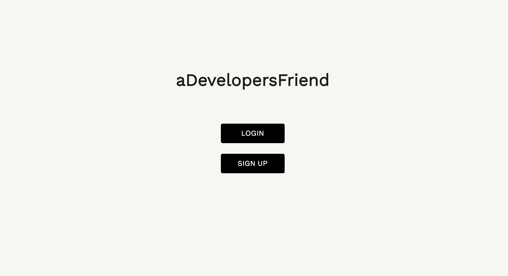
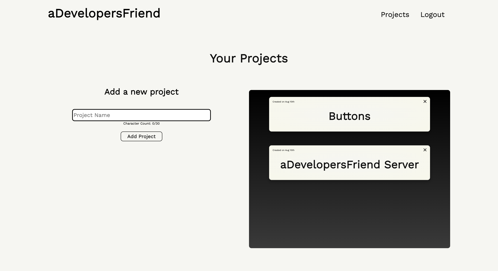
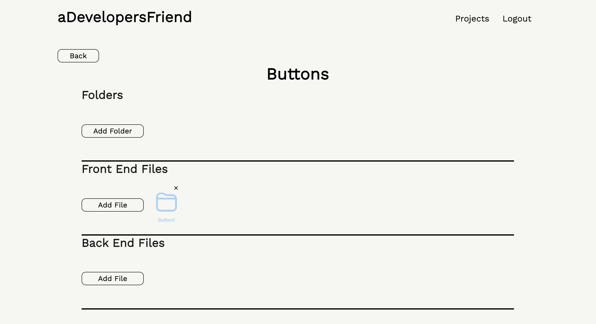
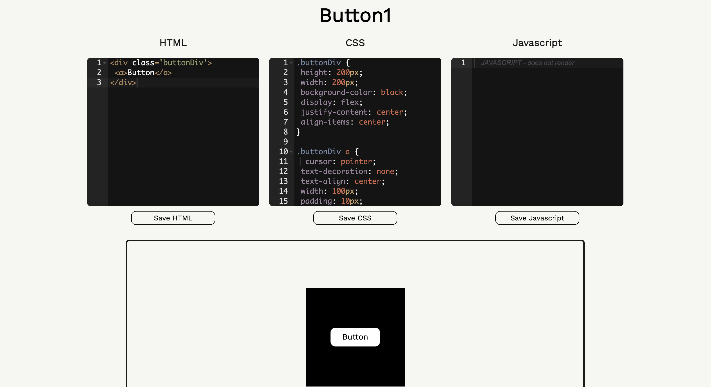
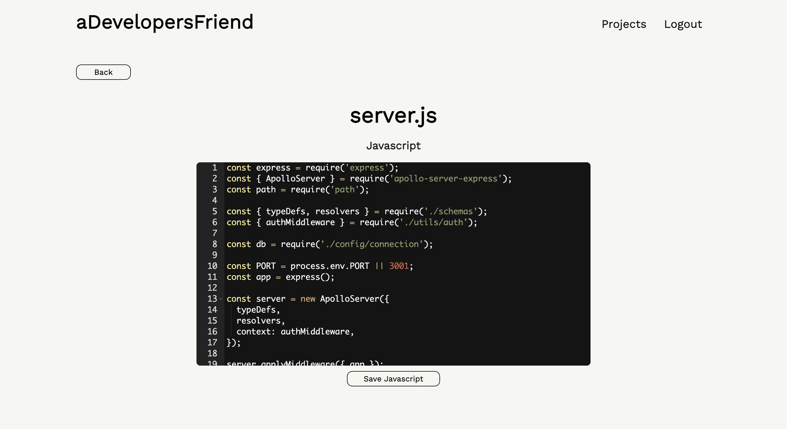

 https://opensource.org/licenses/MIT
  
  # aDevelopersFriend

  ## Deployed Site:
  https://adevelopersfriend.herokuapp.com
  
  ## Description:
  aDevelopersFriend is an application that allows users to store html, css and javascript within files and folders. Users benefit from being able to easily store code they wish to re-use in future projects down to the file structure.The application uses MongoDB, Apollo, Express.js, Node.js, GraphQL and React; as well as a number of other npm packages. Front end code can is displayed on the browser so users can easily identify what their code does (front end javascript currently does not render).
  
  ## Table of contents:
  - [Installation](#installation)
  - [Usage](#usage)
  - [Contribution](#contribution)
  - [Test](#test)
  - [License](#license)
  - [Images](#images)
  - [Questions](#questions)

  ## Installation
  'npm i' will install all packages. You may need to run 'npm install graphql' seperately.

  ## Usage
  Free to use

  ## Contribution
  Please contact me if you would like to contribute anything. There are a few bugs I am still working out so if you notice anything else it would be greatly appreciated if you could let me know :)

  ## Test
  n/a

  ## License
  MIT

  ## Images
  
  
  
  
  

  ## Questions
  Github: https://github.com/SamuelHeal
  Email: samuelheal@hotmail.com
  
